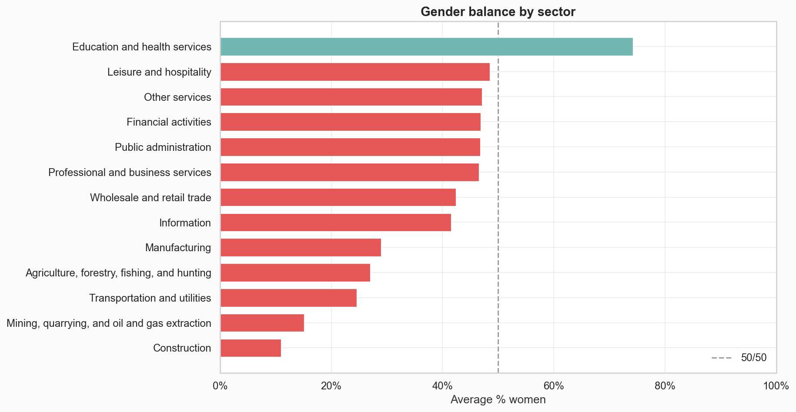
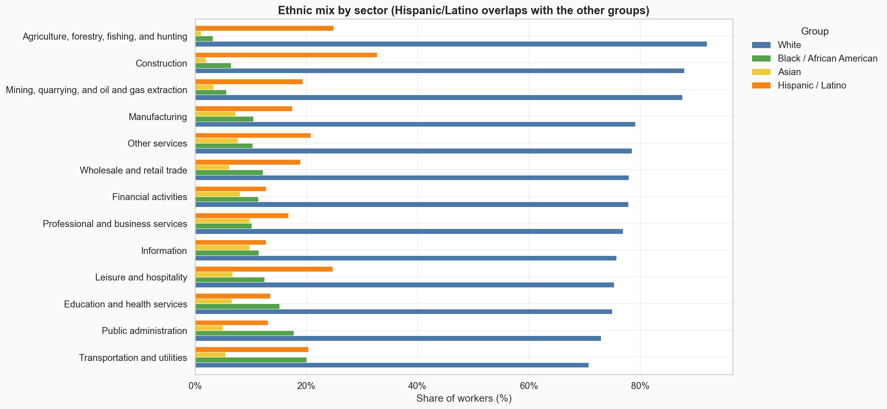
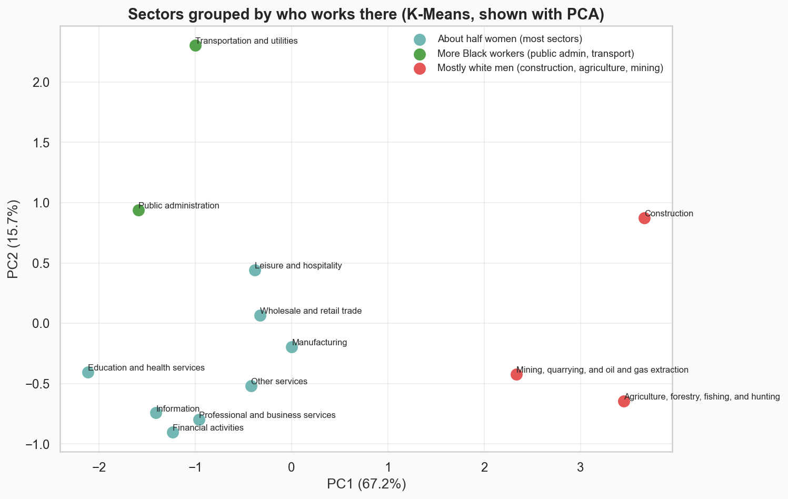
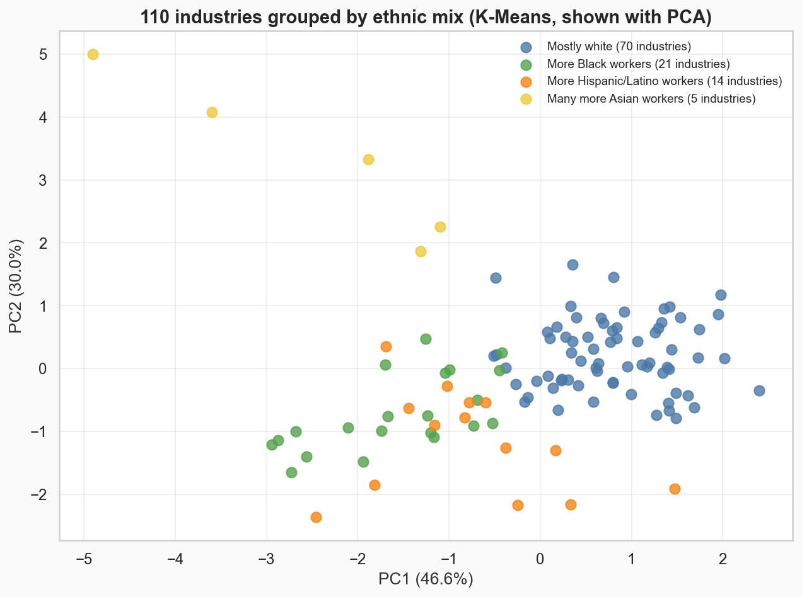

# Workforce diversity: which US industries are the least diverse?

I used US labour force data (2020–2023) to look at who works in each sector and industry: the share of women, and
the share of white, Black, Asian and Hispanic/Latino workers. The analysis is in
[`notebooks/workforce_diversity.ipynb`](notebooks/workforce_diversity.ipynb).



<!-- business:start -->
## Business impact

- **Question:** Which US industries most need diversity hiring?
- **Key finding:** Construction, agriculture and mining. They are 88–92% white, and construction is 89% men. White workers are the majority in every sector (71–92%).
- **Recommendation:** Start diversity hiring in construction, agriculture and mining, and focus on hiring women in construction, mining and transportation. Track the same numbers every year: mining's Hispanic/Latino share rose 5 points in two years, so they can move.
- **Estimated impact:** **89%** of construction workers are men, the most male-dominated sector (mining is 85%).
- **Case study:** [boredmongoose.github.io/projects/workforce.html](https://boredmongoose.github.io/projects/workforce.html)
<!-- business:end -->

## What I found

| # | Finding | Numbers |
|---|---|---|
| 1 | **Construction, agriculture and mining are the least diverse sectors.** | 88–92% white; construction is 89% men, mining 85% |
| 2 | **White workers are the majority in every sector.** | from 71% (transportation and utilities) to 92% (agriculture) |
| 3 | **Education and health is the biggest and most female sector.** | 75% women, 23% of all workers |
| 4 | **Mining changed the most between 2021 and 2023.** | Hispanic/Latino share up 5.4 points |
| 5 | **110 industries fall into four groups.** | 70 mostly white, 21 with more Black workers, 14 with more Hispanic workers, 5 with many more Asian workers |



## How I did it

1. **Cleaned the data:** dropped blank rows and the "Total" row, fixed percentages typed as whole numbers (87.5
   instead of 0.875), and removed one impossible value (an Asian share above 100%).
2. **Answered six questions** with pandas: which sectors look alike, which are most male or female, which changed
   most, whether one group dominates, whether bigger sectors are more diverse, and which industries look alike.
3. **Grouped sectors and industries with K-Means** (scikit-learn), after standardising the columns, and chose the
   number of groups with the elbow method. PCA puts the groups on a 2D chart.
4. **Scored diversity with Shannon entropy:** higher means workers are spread more evenly across the groups.

<p float="left">
  
  
</p>

## Limitations

- Only four years of data (2020–2023).
- Hispanic/Latino is an ethnicity, so it overlaps with the race groups and the shares don't add up to 100%.
- The percentages are survey estimates, so small industries can jump around from year to year.
- K-Means always finds groups, even weak ones, so the groups describe the data rather than prove anything.

<!-- next:start -->
## Next steps

1. Add pay data, to see whether the least diverse industries also pay differently.
2. Use more years, to tell real changes from survey noise.
3. Look at job level (entry level vs management), not just the industry.
<!-- next:end -->

## Setup

You need Python 3.11+ with pandas, numpy, matplotlib, seaborn, scikit-learn and jupyter. With conda:

```bash
conda create -n strata-clustering python=3.11 pandas numpy matplotlib seaborn scikit-learn jupyter ipykernel -y
conda activate strata-clustering
```

(`environment.yml` is my full environment export; it includes a machine-specific `prefix` line you may need to remove.)

## Reproduce

1. Put `dataset-google.csv` in `data/raw/` (CSV files are not tracked in git).
2. Run the notebook from the `notebooks/` folder:

```bash
cd notebooks
jupyter notebook workforce_diversity.ipynb
```

The notebook saves its charts into `images/`. `notebooks/workforce_diversity.py` is the same notebook as a plain
Python file (made with jupytext), which is easier to read in a diff.

## Project structure

```
strata-clustering/
├── data/raw/dataset-google.csv      # employment demographics (not tracked in git)
├── notebooks/
│   ├── workforce_diversity.ipynb    # the analysis, with outputs
│   └── workforce_diversity.py       # the same notebook as plain Python
├── images/                          # charts saved by the notebook
├── environment.yml
└── README.md
```

## Data columns

| Column | Description |
|---|---|
| `year` | Survey year (2020–2023) |
| `sector` | Top-level industry sector |
| `subsector`, `industry_group`, `industry` | Lower levels (empty on sector-level rows) |
| `total_employed_in_thousands` | Total employment |
| `percent_women` | Share of women |
| `percent_white`, `percent_black_or_african_american`, `percent_asian`, `percent_hispanic_or_latino` | Ethnic shares |
